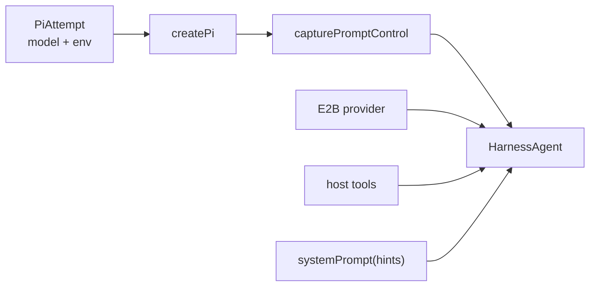

`apps/bot/src/lib/agent/index.ts` is the turn runner. `packages/ai/src/agent.ts` builds the agent.

The central rule:

**HarnessAgent owns the agent loop. Pi runs inside the bot process. E2B is the workspace.**

## What `createAgent` Builds

`packages/ai/src/agent.ts` creates:

- `createPi({ auth.customEnv, model, thinkingLevel })`;
- `HarnessAgent({ harness: pi, sandbox, tools, permissionMode: 'allow-all' })`;
- `onSandboxSession` setup for prompt files, skills, attachments, and session restore;
- a small prompt-control wrapper so the app can steer active turns.

## Prompt Shape

`packages/ai/src/prompts/index.ts` joins:

- core identity and Slack basics;
- default personality;
- sandbox instructions;
- host tool instructions;
- request context like time, workspace, channel, thread id, and message id;
- optional user customization from App Home.

The prompt deliberately tells Pi to fetch Slack history with tools when earlier context matters. Bounded Slack context preload is still planned.

## Attempts

`packages/ai/src/providers/pi.ts` defines ordered `PiAttempt` entries. A turn tries the first available attempt, and `apps/bot/src/lib/ai/attempts.ts` decides whether to retry or fall back.

Current behavior:

- attempts are selected before the turn;
- if a turn has already streamed text or task rows, the app does not silently switch models;
- same-model retries can wait with backoff;
- fallback attempts are app-level, not native Pi retry yet.

Old Gorkie had Pi retry configured more directly. Restoring cleaner native retry is still open work.

## Host Tools

`apps/bot/src/lib/ai/toolset.ts` combines:

- Chat SDK tools from `createChatTools({ preset: 'messenger' })`;
- Gorkie tools: `searchSlack`, `searchWeb`, `summarizeThread`, `generateImage`, `uploadFile`, `mermaid`, and `scheduleReminder`.

These tools execute on the bot host. They are not shell commands inside E2B. If a tool needs a file from the sandbox, it reads it through the active sandbox session.

## Native Pi Tools

Pi provides coding tools through the harness adapter:

- `bash`
- `read`
- `write`
- `edit`
- `grep`
- `glob`
- `ls`

The model sees these as normal tools, but the adapter maps them to sandbox-backed filesystem and command operations.

## Steering

When a user replies while a turn is active:

1. `runTurn` sees an active turn for the thread.
2. The new message is added to `pendingMessages`.
3. If Pi exposed `submitUserMessage`, Gorkie submits the text into the running turn.
4. If native steering is unavailable or fails, Gorkie aborts and reruns from the latest pending message.

This is why `packages/ai/src/agent.ts` wraps prompt control. The underlying Harness/Pi protocol already has a control surface; the app needs access to it while a turn is in flight.

## Stop

The stop button calls `stopTurn({ threadId })`, which aborts the active turn controller. Abort does not destroy the session; the app parks the session so the next turn can resume from saved state.

The stop button is currently a separate Slack control message because Chat SDK's `StreamingPlan.endWith` appends controls after streaming completes. It does not provide an active-stream control slot yet.
