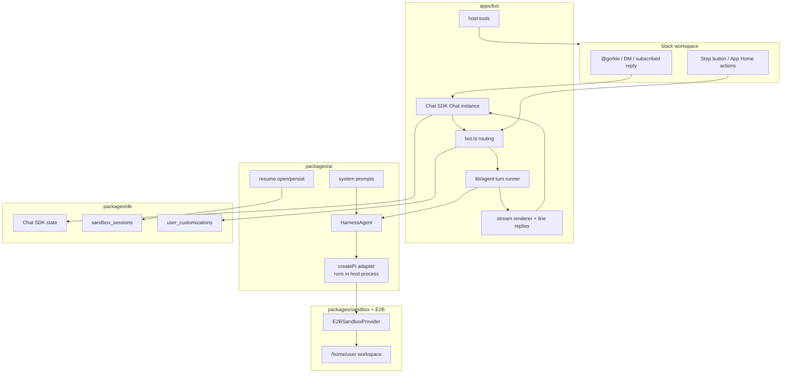
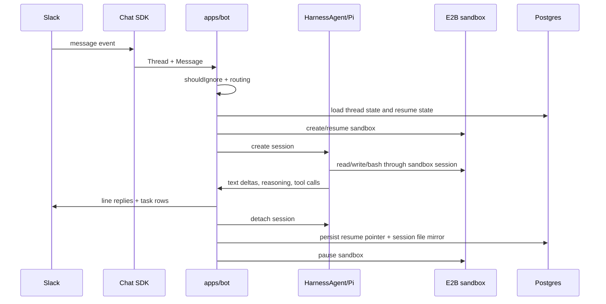

# Architecture

Gorkie v2 is a Slack runtime around an AI SDK HarnessAgent. The Slack side is deliberately app-owned. The agent core is platform-neutral. The sandbox provider is a package because HarnessAgent speaks a provider interface, not Slack.

## The Mental Model

**Pi runs on the bot machine.**

Pi is not installed inside E2B as the main process. The bot process starts the Pi adapter in Node, and the Pi adapter makes sandbox filesystem and command operations look local through a host mirror, path mapper, and remote operations layer.

That is why:

- model keys stay in the bot process;
- future BYOK and MCP secrets should stay out of the sandbox;
- the sandbox can be paused, recreated, or mirrored without changing Slack routing;
- host tools can talk to Slack directly while Pi still sees their results.

## Package Ownership

`apps/bot` owns runtime behavior that only makes sense for Slack or this process: event routing, Slack adapter setup, stop controls, line replies, Chat SDK tool selection, host tools, App Home, and logging.

`packages/ai` owns platform-neutral agent setup: creating the HarnessAgent, creating Pi, loading prompts, selecting attempts, opening/persisting sessions, and translating request hints into system prompt text.

`packages/sandbox` owns the E2B implementation of the Harness sandbox provider. It hides E2B APIs behind `HarnessV1SandboxProvider` and `Experimental_SandboxSession`.

`packages/db` owns Drizzle schema and queries. It does not know about Slack UI.

## Turn Flow

## Why HarnessAgent

HarnessAgent gives Gorkie one contract for coding-agent runtimes:

- one session per Slack thread;
- native built-in tools like `bash`, `read`, `write`, `edit`, `grep`, `glob`, and `ls`;
- host-defined AI SDK tools for Slack, web, images, reminders, and uploads;
- stream events for text, reasoning, tool calls, tool results, errors, and compaction;
- resume/continue lifecycle state;
- permission and approval surfaces.

Without HarnessAgent, Gorkie would have to own a lot of fragile agent loop behavior itself. The rewrite wants the harness to own that loop.

## Why Chat SDK

Chat SDK gives Gorkie a normalized Slack surface:

- `Chat` owns adapters, dedupe, locking, subscriptions, and state.
- `Thread` and `Message` normalize Slack events.
- `onNewMention`, `onDirectMessage`, and `onSubscribedMessage` cover the main routing paths.
- `createChatTools` exposes useful Slack reader/writer tools to the agent.
- `StreamingPlan` lets us stream task rows separately from plain assistant text.

We still use Slack escape hatches when needed: native assistant status, App Home, stop controls, files, scheduled messages, and assistant search.

## Hard Boundaries

- Do not put Slack-only tools in `packages/ai`.
- Do not put model keys or MCP secrets in the sandbox.
- Do not make the sandbox the source of truth for Slack routing.
- Do not make Chat SDK transcript storage the agent brain. Pi/Harness session history is the brain.
- Do not add abstractions unless they remove real complexity.
