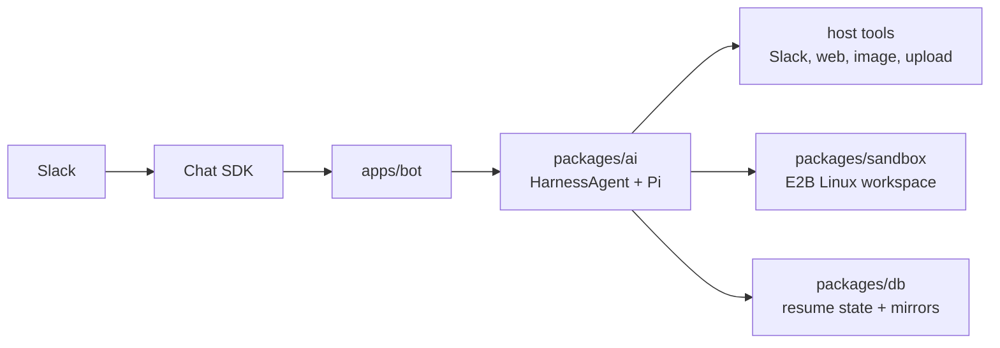

# Gorkie v2

Gorkie is a Slack bot wrapped around a coding agent.

The most important thing to know:

**Pi runs on the bot machine. The sandbox is remote file and command execution.**

That one sentence explains most of the architecture. The agent brain, model auth, tool orchestration, history, and prompt loading happen in the bot process. The E2B sandbox gives that host process a Linux workspace where Pi can read files, write files, run commands, and keep per-thread state.

Use these docs when you want to answer "where does this behavior live?" before changing code.

## Read This First

- [Architecture](./architecture) explains the big pieces and request flow.
- [Slack Runtime](./slack-runtime) explains Chat SDK, routing, subscriptions, and DMs.
- [Agent Runtime](./agent-runtime) explains HarnessAgent, Pi, prompts, tools, attempts, and steering.
- [Sandbox And Sessions](./sandbox-sessions) explains E2B, host mirrors, session files, resume, and skills.
- [Streaming And Tools](./streaming-tools) explains Slack output, task rows, line chunking, and host tools.
- [Data Model](./data-model) explains Postgres tables and what each one owns.
- [Development](./development) explains commands, local runtime, template builds, and checks.
- [Open Work](./open-work) lists the current architectural debt and the next cleanup passes.

## Source Map

| Area | Files |
| --- | --- |
| Slack event routing | `apps/bot/src/bot.ts` |
| Chat SDK setup | `apps/bot/src/lib/chat.ts` |
| Turn orchestration | `apps/bot/src/lib/agent/index.ts` |
| Stop button and steering | `apps/bot/src/lib/agent/controls.ts`, `apps/bot/src/lib/agent/steering.ts` |
| Slack reply chunking | `apps/bot/src/lib/agent/line-reply.ts` |
| Stream/task rendering | `apps/bot/src/lib/ai/stream/**` |
| Host tools | `apps/bot/src/lib/ai/tools/**`, `apps/bot/src/lib/ai/toolset.ts` |
| Harness/Pi assembly | `packages/ai/src/agent.ts` |
| Prompts and model attempts | `packages/ai/src/prompts/**`, `packages/ai/src/providers/**` |
| Session resume | `packages/ai/src/sessions.ts`, `packages/ai/src/files/**` |
| E2B provider | `packages/sandbox/src/**` |
| Postgres schema/queries | `packages/db/src/**` |

## Current Shape

This is still a rewrite branch. The architecture is intentionally smaller than old Gorkie:

- Slack comes through Chat SDK instead of Bolt-first custom routing.
- Pi/Harness owns the agent history and compaction.
- E2B owns the Linux workspace.
- Postgres stores Chat SDK state, sandbox runtime state, resume pointers, session-file mirrors, and user customizations.
- Old-Gorkie tool parity is still being restored before broader simplification.
