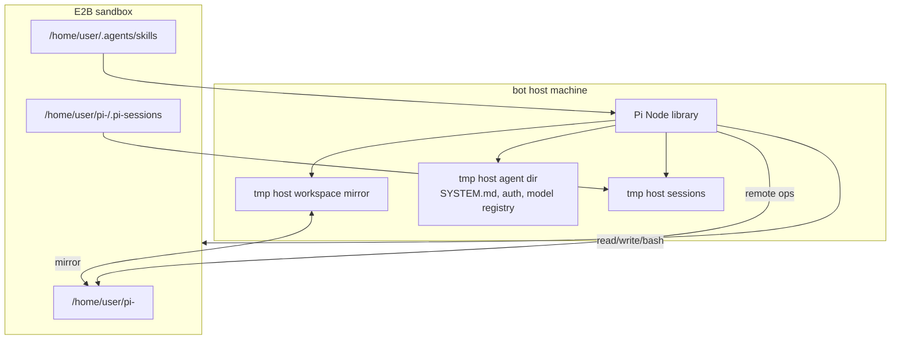
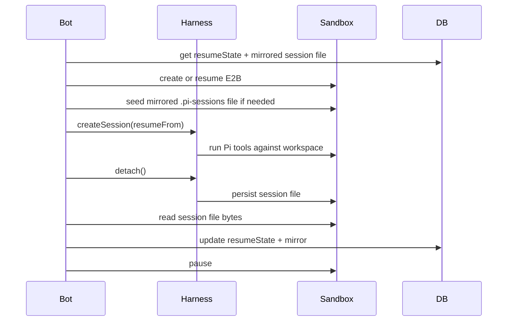

The sandbox is a persistent Linux workspace for one Slack conversation. It is not where the Pi brain runs.

Pi runs on the bot machine. The sandbox gives Pi remote filesystem and shell access.

## Runtime Layout



The upstream Pi adapter confirms this: `createPi` is an in-process Node adapter with no bridge. It snapshots sandbox state into a host mirror, mounts the sandbox path through a VFS, and maps Pi's file operations back to sandbox operations.

## E2B Provider

`packages/sandbox/src/provider.ts` implements `HarnessV1SandboxProvider`.

It can:

- create a new E2B sandbox from `gorkie-sandbox:3.0`;
- resume a stored sandbox by id;
- detect missing/stale sandboxes and create a fresh one;
- pause a sandbox after a completed turn;
- update `sandbox_sessions` rows with active/paused runtime state.

`packages/sandbox/src/session.ts` adapts E2B to the AI SDK sandbox interface:

- `readTextFile`, `readBinaryFile`;
- `writeTextFile`, `writeBinaryFile`;
- `run`;
- `spawn`;
- `restricted()`;
- network infra methods from the full session.

## Session Persistence

There are two different things:

| Thing | Stored where | Meaning |
| --- | --- | --- |
| `resumeState` | Postgres text | Pointer that tells Harness/Pi which session file to reopen. |
| Pi session file | Sandbox plus Postgres mirror | Actual transcript and tool history. |

`packages/ai/src/sessions.ts` opens and persists sessions.

<Steps>
  <Step>
    Load `sandbox_sessions.resumeState`.
  </Step>

  <Step>
    Strip stale `continueFrom` from old unfinished turns.
  </Step>

  <Step>
    Call `agent.createSession({ sessionId, resumeFrom })`.
  </Step>

  <Step>
    On completion, call `session.detach()` and strip `continueFrom` before storing normal resume state.
  </Step>

  <Step>
    Find the Pi session file, read it from the sandbox when available, and mirror it in Postgres.
  </Step>
</Steps>



## Skills

The E2B template installs real upstream Agent Skills:

- `agent-browser`
- `agentmail`

The template build verifies that their `SKILL.md` files exist under `/home/user/.agents/skills`.

At runtime, `packages/ai/src/files/skills.ts` reads those installed skill folders and passes them into Harness `skills`. This matters because the Pi adapter gives first-class treatment to Harness-provided skills: it materializes them under sandbox `$HOME/.agents/skills` and injects them into the Pi resource loader.

The template remains the source of truth. The bot does not vendor these skill files.

## Template Build

`packages/sandbox/src/scripts/build-template.ts` builds the E2B template. It installs base tools, Node 24, Python packages, `agent-browser`, browser dependencies, and Agent Skills.

Root command:

```sh
bun run build:template
```

The script loads `apps/bot/.env` through `dotenv` so `E2B_API_KEY` does not need to be tracked in code.
