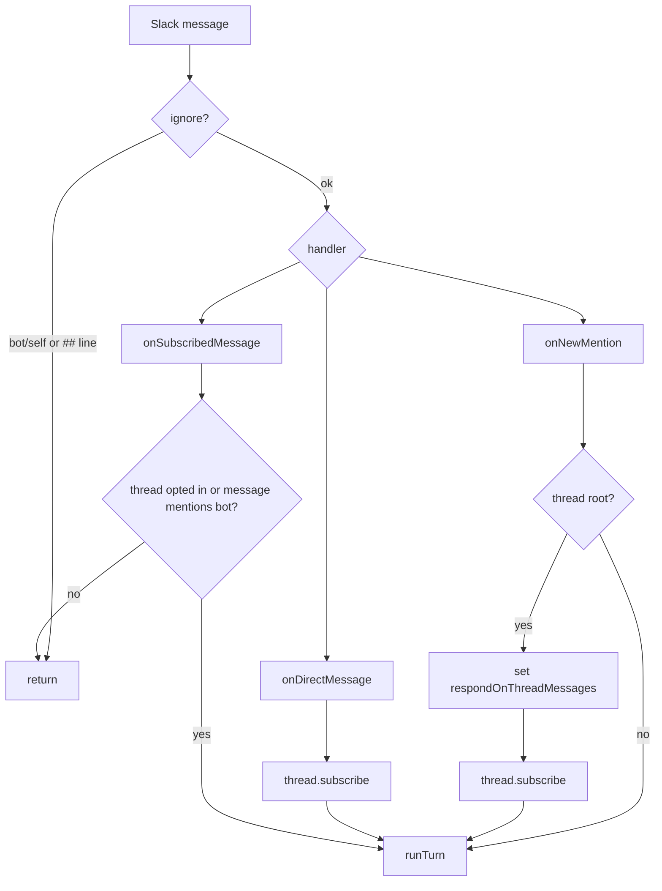

# Slack Runtime

Slack enters Gorkie through Chat SDK socket mode.

`apps/bot/src/lib/chat.ts` creates:

- a Slack adapter with `SLACK_APP_TOKEN` and `SLACK_BOT_TOKEN`;
- a Postgres Chat SDK state adapter;
- a `Chat` instance named `gorkie`;
- a logger bridge that prefixes Chat SDK logs with `[chat]`.

## Routing

`apps/bot/src/bot.ts` wires the main handlers:

| Handler | Meaning in Gorkie |
| --- | --- |
| `onNewMention` | A user mentioned Gorkie in an unsubscribed Slack thread or root message. |
| `onDirectMessage` | A user DM'd Gorkie. |
| `onSubscribedMessage` | A message arrived in a thread Gorkie subscribed to. |
| `onAction('gorkie_stop_turn')` | A user clicked the active-turn stop button. |



## Ignore Rule

The ignore marker is `##`.

The Slack raw text can start with mention tokens, so the router strips leading `<@USER>` tokens on each line before checking `##`. That means these are ignored:

```text
## do not answer
@gorkie ## do not answer
@gorkie normal first line
## ignore because one line asked for ignore
```

Bot/self messages are always ignored.

## Thread State

Gorkie only answers ordinary follow-up messages in threads it opted into. The thread state flag is:

```ts
{ respondOnThreadMessages: true }
```

Root mentions set the flag and subscribe the thread. This keeps Gorkie from joining random Slack threads forever after one incidental mention.

## DMs

DMs are direct intent. The bot subscribes to the DM thread and runs a turn.

This is useful, but it creates a privacy concern for broad reader tools: Gorkie can read DMs the bot token can access. Reader tools must stay scoped so one user cannot use the agent to sniff another user's private DM context.

## Slack Escape Hatches

Chat SDK handles the normal platform shape. Gorkie still reaches for Slack APIs directly for Slack-specific behavior:

- assistant thinking status;
- App Home;
- stop button block;
- file upload;
- scheduled reminder messages;
- assistant search context.

Those escape hatches stay in `apps/bot`.
