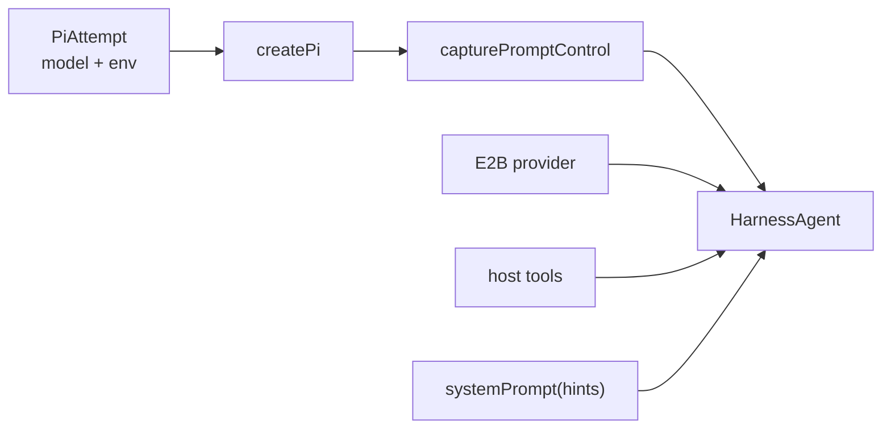

This page covers the agent itself: how it is built, what it can do, and how a turn behaves while it runs. The two anchor files are `apps/bot/src/lib/agent/index.ts` (the turn runner) and `packages/ai/src/agent.ts` (the agent builder).

The central rule:

**HarnessAgent owns the agent loop. Pi runs inside the bot process. E2B is the workspace.**

## What `createAgent` Builds

`packages/ai/src/agent.ts` exports `createAgent`, which assembles one agent per turn:

- `createPi({ auth: { customEnv }, model, thinkingLevel: 'medium' })`, where `customEnv` and `model` come from the selected attempt;
- a `HarnessAgent` configured with `harness: pi`, the `sandbox` provider, the host `tools`, the available `skills`, and `permissionMode: 'allow-all'`;
- an `onSandboxSession` callback that runs on every fresh or resumed session to write the system prompt, sync the mirrored session file, seed attachments, and refresh skills;
- a small `capturePromptControl` wrapper around Pi so the app can steer the turn while it is in flight (see [Steering](#steering)).

## Prompt Shape

`packages/ai/src/prompts/index.ts` builds the system prompt by joining several sections in order (`systemPrompt(hints)`):

- core identity and Slack basics (`core.ts`);
- default personality (`personality.ts`);
- sandbox instructions (`sandbox.ts`);
- host tool instructions (`tools.ts`);
- request context such as the current time, workspace, channel name/id, thread id, and the id of the message being answered (`context.ts`);
- optional per-user customization from App Home (`customization.ts`).

The context section deliberately tells Pi to fetch earlier channel or thread history with the Slack/Chat SDK tools rather than pretending it already saw it. The request context comes from `requestHints()` in `apps/bot/src/lib/ai/hints.ts`, which is computed per turn.

## Attempts

`packages/ai/src/providers/pi.ts` defines an ordered list of `PiAttempt` entries (`chatAttempts`). Each attempt names a provider, a model, and the `customEnv` (the API key and base URL) that Pi should use. A turn starts with the first attempt; `apps/bot/src/lib/ai/attempts.ts` decides whether a failure should retry the same model or fall back to the next attempt.

The model layer speaks the OpenRouter protocol, which lets the same `PiAttempt` shape cover several providers. The primary provider is HackClub AI (an OpenRouter-compatible proxy), with OpenRouter and other inference endpoints available as fallbacks when their keys are configured.

How the runner uses attempts (`renderTurn` in `apps/bot/src/lib/agent/index.ts`):

- the first attempt is selected before any text is streamed;
- once a turn has already streamed assistant text or task rows, it does not silently switch models — a failure at that point surfaces as an error instead;
- a same-model retry can wait with backoff before trying again (`attemptDelayMs`);
- before retrying, the failed session is detached without persisting its unfinished continuation, so a failed attempt never overwrites the last good checkpoint.

## Host Tools

`apps/bot/src/lib/ai/toolset.ts` (`buildTools`) combines two groups:

- Chat SDK tools from `createChatTools({ chat: bot, preset: 'messenger', requireApproval: false })` — message, thread, channel, user, and reaction operations;
- Gorkie's own tools: `searchSlack`, `searchWeb`, `summarizeThread`, `generateImage`, `uploadFile`, `mermaid`, and `scheduleReminder`.

These tools execute on the bot host, not as shell commands inside E2B. When a tool needs a file from the sandbox — for example `uploadFile` — it reads it through the active sandbox session, and `uploadFile` is restricted to paths inside the session workspace. See [Streaming And Tools](./streaming-tools) for what each tool does and how its activity is rendered in Slack.

## Native Pi Tools

Pi provides coding tools through the harness adapter:

- `bash`
- `read`
- `write`
- `edit`
- `grep`
- `glob`
- `ls`

The model sees these as normal tools, but the adapter maps them to sandbox-backed filesystem and command operations.

## Steering

Steering lets a user redirect a turn that is already running instead of waiting for it to finish. The runner keeps a map of `activeTurns` keyed by thread id, so it can tell when a new message lands mid-turn.

When a user replies while a turn is active (`steerActiveTurn` in `apps/bot/src/lib/agent/steering.ts`):

1. `runTurn` finds an existing `ActiveTurn` for the thread.
2. The new message is appended to `pendingMessages`.
3. If Pi has exposed a `submitUserMessage` prompt control, Gorkie drains the pending queue into the running turn and posts an ephemeral "Steering conversation" confirmation.
4. If native steering is unavailable or fails, Gorkie aborts the turn's controller; the runner's `finally` block then reruns from the latest pending message.

The prompt control is delivered through the `capturePromptControl` wrapper in `packages/ai/src/agent.ts`. The Harness/Pi protocol already exposes `submitUserMessage`; the wrapper captures the live control for each turn and hands it to the app via `setPromptControl`, so the app can steer while the turn is in flight and drops the control again when the turn ends.

## Stop

The stop button calls `stopTurn({ threadId })`, which aborts the active turn's `AbortController`. Aborting does not destroy the session — the runner parks the session (without pausing the sandbox) so the next turn can resume from the saved checkpoint. If there is no active turn to stop, the handler posts an ephemeral "No active response to stop."

The stop button is posted as a separate Slack control message (`postTurnControls` in `apps/bot/src/lib/agent/controls.ts`) rather than as part of the stream, and it is removed when the turn finishes. Chat SDK's streaming plan only appends controls after streaming completes, so an in-stream control message is used to give users a stop affordance while the agent is still responding.
