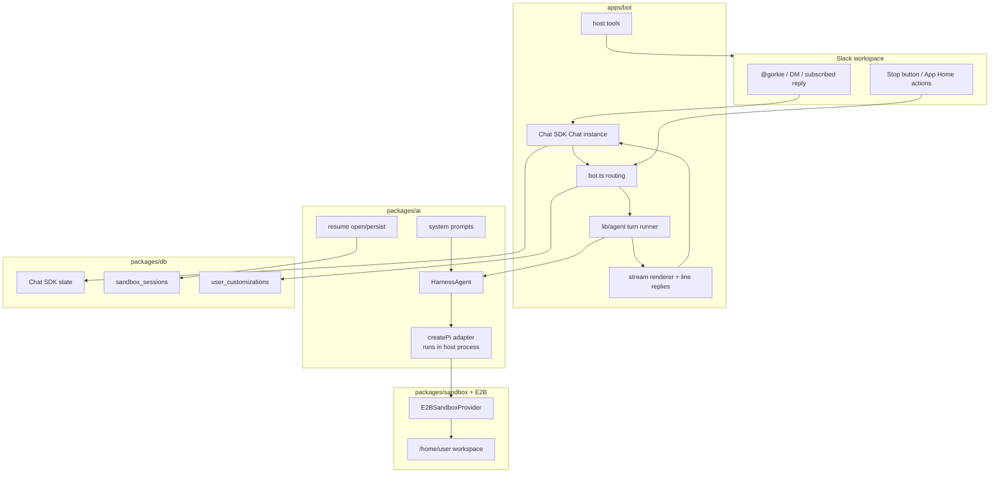
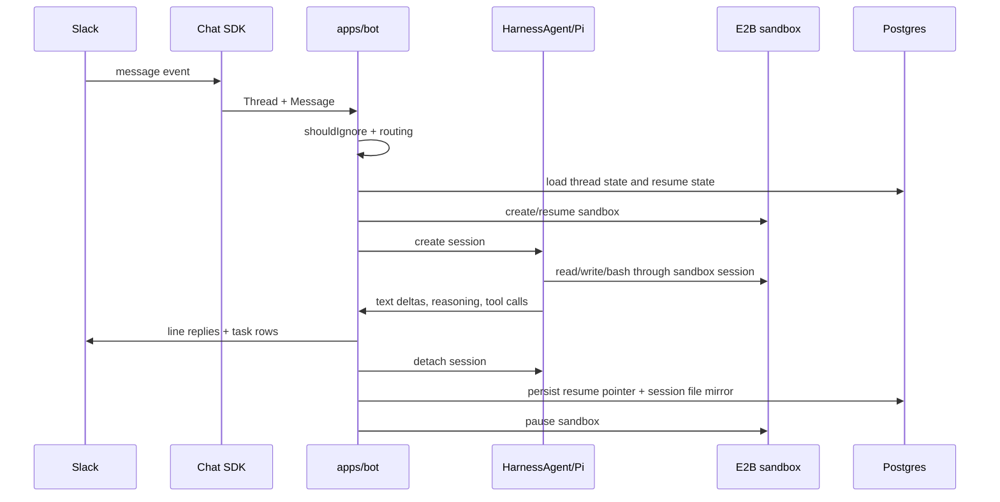

Gorkie is a Slack runtime built around an AI SDK `HarnessAgent`. The three layers have deliberately different scopes: the Slack side is app-owned, the agent core is platform-neutral, and the sandbox provider is its own package because `HarnessAgent` talks to a sandbox through a provider interface, not through Slack.

## The Mental Model

**Pi runs on the bot machine.**

Pi is not installed inside E2B as the main process. The bot process starts the Pi adapter in Node, and the Pi adapter makes sandbox filesystem and command operations look local through a host mirror, a path mapper, and a remote-operations layer. From Pi's point of view it is editing local files; under the hood those operations are forwarded to the remote sandbox.

That separation is the load-bearing design choice. It is why:

- model keys stay in the bot process and never touch the sandbox;
- per-user keys (BYOK) and MCP secrets can be added later without leaking into the sandbox;
- the sandbox can be paused, recreated, or mirrored without changing Slack routing;
- host tools (Slack, web search, image generation) can talk to Slack directly while Pi still sees their results in its tool loop.

## Package Ownership

`apps/bot` owns runtime behavior that only makes sense for Slack or for this process: event routing, Slack adapter setup, stop controls, line replies, Chat SDK tool selection, the bot-owned host tools, App Home, and logging. It also runs the per-turn orchestration loop in `lib/agent`.

`packages/ai` owns platform-neutral agent setup: creating the `HarnessAgent`, creating Pi, loading and assembling prompts, selecting model attempts, opening and persisting sessions, and turning request hints into system-prompt text. It contains nothing Slack-specific.

`packages/sandbox` owns the E2B implementation of the Harness sandbox provider. `E2BSandboxProvider` implements `HarnessV1SandboxProvider`, and `E2BNetworkSandboxSession` adapts E2B to the AI SDK `Experimental_SandboxSession` interface. The package manages sandbox lifecycle (create, resume, pause) and hides the E2B APIs from everything above it.

`packages/db` owns the Drizzle schema and queries. It does not know about Slack UI.

## Turn Flow

## Why HarnessAgent

`HarnessAgent` gives Gorkie one contract for coding-agent runtimes:

- one session per Slack thread;
- native built-in tools like `bash`, `read`, `write`, `edit`, `grep`, `glob`, and `ls`;
- host-defined AI SDK tools for Slack, web search, images, reminders, and uploads;
- a unified stream of events for text, reasoning, tool calls, tool results, errors, and compaction;
- resume/continue lifecycle state, so a thread survives restarts;
- permission and approval surfaces.

The agent loop, history, and compaction are the hard parts of running a coding agent, and the harness owns all of them. That keeps Gorkie's own code focused on wiring Slack to the agent rather than reimplementing the loop.

## Why Chat SDK

Chat SDK gives Gorkie a normalized Slack surface:

- `Chat` owns adapters, dedupe, locking, subscriptions, and state.
- `Thread` and `Message` normalize Slack events into a platform-neutral shape.
- `onNewMention`, `onDirectMessage`, and `onSubscribedMessage` cover the main routing paths.
- `createChatTools` exposes Slack reader/writer tools to the agent.
- `StreamingPlan` lets Gorkie stream task rows separately from plain assistant text.

When a Slack-specific capability is needed, Gorkie reaches past Chat SDK to the raw Slack APIs: native assistant status, App Home, the stop-button control message, file uploads, scheduled reminder messages, and assistant search. These escape hatches all stay in `apps/bot`.

## Hard Boundaries

- Do not put Slack-only tools in `packages/ai`.
- Do not put model keys or MCP secrets in the sandbox.
- Do not make the sandbox the source of truth for Slack routing.
- Do not make Chat SDK transcript storage the agent brain. Pi/Harness session history is the brain.
- Do not add abstractions unless they remove real complexity.
