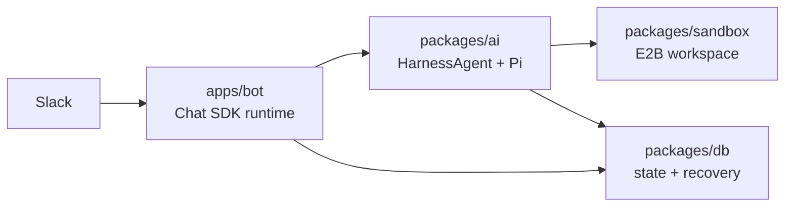
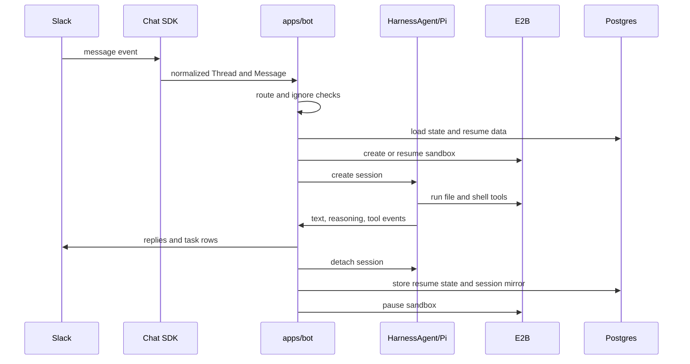

Gorkie has three major runtime pieces: Slack, the agent, and the sandbox.

Slack is the interface. The agent is the brain. The sandbox is the workspace.

## Mental Model

Pi is created by the bot process through AI SDK Harness. It is not a daemon inside E2B. When Pi reads a file, writes a file, edits code, or runs a shell command, the Harness/Pi adapter forwards that operation to the sandbox session.

That split keeps secrets on the host and keeps execution isolated:

- model provider keys stay in the bot process;
- Slack tokens stay in the bot process;
- host tools can call Slack, Exa, image generation, and file upload APIs directly;
- E2B only handles filesystem and command execution;
- a missing or stale sandbox can be recreated without changing Slack routing.

## Turn Flow

## Package Ownership

`apps/bot` owns Slack runtime behavior: adapter setup, routing, App Home, stop controls, line replies, Chat SDK tool selection, bot-owned tools, and turn orchestration.

`packages/ai` owns platform-neutral agent setup: HarnessAgent creation, Pi creation, prompts, model attempts, and session persistence.

`packages/sandbox` owns the E2B Harness sandbox provider, E2B session adapter, template build, and vendored skill loading.

`packages/db` owns the Drizzle schema, Postgres client, and queries.

## Code Map

| Area | Files |
| --- | --- |
| Slack event routing | `apps/bot/src/bot.ts` |
| Chat SDK setup | `apps/bot/src/lib/chat.ts` |
| Turn orchestration | `apps/bot/src/lib/agent/index.ts` |
| Turn interruption and stop controls | `apps/bot/src/lib/agent/steering.ts`, `apps/bot/src/lib/agent/controls.ts` |
| Slack reply chunking | `apps/bot/src/lib/agent/reply.ts` |
| Stream and task rendering | `apps/bot/src/lib/ai/stream/**` |
| Host tools | `apps/bot/src/lib/ai/tools/**`, `apps/bot/src/lib/ai/toolset.ts` |
| Agent construction | `packages/ai/src/agent.ts` |
| Prompts and request hints | `packages/ai/src/prompts/**`, `apps/bot/src/lib/ai/hints.ts` |
| Session persistence | `packages/ai/src/sessions.ts`, `packages/ai/src/files/**` |
| E2B provider | `packages/sandbox/src/**` |
| Database schema and queries | `packages/db/src/**` |
