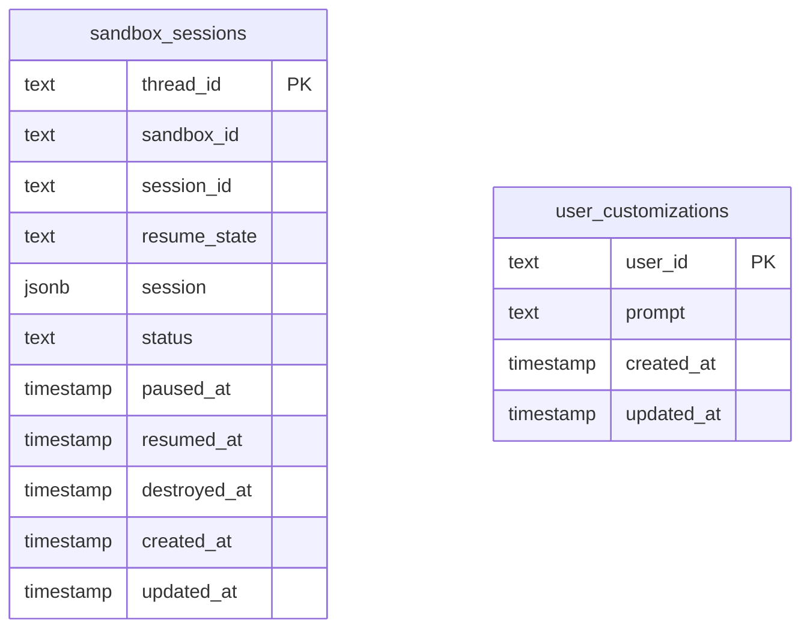

Gorkie uses Postgres for three kinds of state:

- Chat SDK adapter state;
- sandbox/session state;
- user customizations.

The database is not the full agent transcript store. Pi's session file is the transcript. Postgres stores the pointer and a mirror of that file for recovery.

## `sandbox_sessions`

Defined in `packages/db/src/schema/sandbox.ts`.

| Column | Meaning |
| --- | --- |
| `thread_id` | Chat SDK thread id, also Harness session id. |
| `sandbox_id` | E2B sandbox id. |
| `session_id` | Harness session id. Currently same as thread id. |
| `resume_state` | JSON string returned by Harness detach. |
| `session` | JSON mirror of Pi's session file: `{ file, data }`. |
| `status` | `creating`, `active`, `paused`, or future lifecycle states. |
| `paused_at`, `resumed_at`, `destroyed_at` | Runtime lifecycle timestamps. |
| `created_at`, `updated_at` | Row timestamps. |

## `user_customizations`

Defined in `packages/db/src/schema/customizations.ts`.

This stores one prompt per Slack user. App Home writes it. `requestHints()` loads it and `customizationPrompt()` injects it into the system prompt.

## Chat SDK State

`@chat-adapter/state-pg` owns its own state tables. Gorkie uses it for Chat SDK concerns:

- subscriptions;
- thread state;
- locks;
- dedupe;
- adapter-managed history/cache when applicable.

Do not confuse Chat SDK state with Pi memory. Chat SDK gets events to the handler. Pi/Harness owns the agent conversation.

## What Not To Store Here

Do not add a parallel full Slack transcript just to make the model remember. The bounded Slack context preload on the [roadmap](./open-work) fetches recent messages each turn and tells Pi the limits; it is per-turn retrieval, not durable storage. Pi's own session history remains the durable conversation memory.
