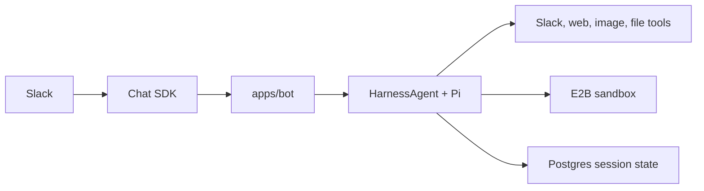

Gorkie is an AI assistant for Slack. It can answer normally, use Slack context, search the web, run code, create files, generate images, and upload results back into the conversation.

<Callout type="info" title="Core model">
  Pi runs on the bot machine. E2B is the remote Linux workspace where file and shell operations happen.
</Callout>

Each Slack conversation gets its own agent session and sandbox workspace. The agent loop, model configuration, prompts, Slack tools, and session recovery live in the bot process. The sandbox gives that process a safe place to run commands and keep working files.

## Start Here

<Cards>
  <Card href="./architecture" title="Architecture" description="System boundaries, request flow, and package ownership." />
  <Card href="./runtime/slack" title="Slack Runtime" description="How Slack events become Gorkie turns." />
  <Card href="./runtime/agent" title="Agent Runtime" description="How HarnessAgent and Pi run a turn." />
  <Card href="./runtime/sandbox" title="Sandbox And Sessions" description="E2B lifecycle, session files, recovery, and skills." />
  <Card href="./runtime/streaming" title="Streaming" description="Assistant text, task rows, stop controls, and Slack limits." />
  <Card href="./reference/tools" title="Tools" description="The model-facing tool surface and safety boundaries." />
  <Card href="./reference/prompts" title="Prompts" description="How the system prompt is assembled." />
  <Card href="./reference/data-model" title="Data Model" description="What Postgres stores and why." />
</Cards>

## Main Flow

1. Slack sends a message event through the Chat SDK Slack adapter.
2. `apps/bot` decides whether Gorkie should answer.
3. The bot creates or resumes the thread's E2B sandbox.
4. `packages/ai` builds a HarnessAgent with Pi, prompts, tools, skills, and resume state.
5. Pi streams text, reasoning, and tool activity.
6. The bot renders assistant text and task rows back into Slack.
7. The session is detached, mirrored, stored, and the sandbox is paused.

## Boundaries

- Slack routing and UI live in `apps/bot`.
- Agent construction and prompts live in `packages/ai`.
- E2B sandbox lifecycle lives in `packages/sandbox`.
- Database schema and queries live in `packages/db`.
- The sandbox does not receive model keys or Slack secrets.
