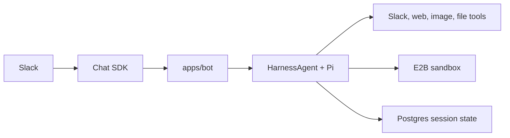

Gorkie is an AI assistant for Slack. It can answer normally, use Slack context, search the web, run code, create files, generate images, and upload results back into the conversation.

> **Mental Model:** Pi runs on the bot machine. E2B is the remote Linux workspace where file and shell operations happen.

Each Slack conversation gets its own agent session and sandbox workspace. The agent loop, model configuration, prompts, Slack tools, and session recovery live in the bot process. The sandbox gives that process a safe place to run commands and keep working files.

## Start Here

- [Architecture](./architecture): System boundaries, request flow, and package ownership.
- [Bot Runtime](./runtime/bot): How chat events become Gorkie turns.
- [Agent Runtime](./runtime/agent): How HarnessAgent and Pi run a turn.
- [Sandbox And Sessions](./runtime/sandbox): E2B lifecycle, session files, recovery, and skills.
- [Streaming](./runtime/streaming): Assistant text, task rows, stop controls, and Slack limits.
- [Turn Controls](./runtime/controls): Interruption, stop, shutdown, and session parking.
- [Tools](./reference/tools): The model-facing tool surface and safety boundaries.
- [Prompts](./reference/prompts): How the system prompt is assembled.
- [Data Model](./reference/data-model): What Postgres stores and why.
- [TODO](./todo): Remaining reliability, context, tool, and upstream work.

## Main Flow

1. A chat adapter sends a message event through Chat SDK.
2. `apps/bot` decides whether Gorkie should answer.
3. The bot creates or resumes the thread's E2B sandbox.
4. `packages/ai` builds a HarnessAgent with Pi, prompts, tools, skills, and resume state.
5. Pi streams text, reasoning, and tool activity.
6. The bot renders assistant text and task rows back into Slack.
7. The session is detached, mirrored, stored, and the sandbox is paused.

## Boundaries

- Slack routing and UI live in `apps/bot`.
- Agent construction and prompts live in `packages/ai`.
- E2B sandbox lifecycle lives in `packages/sandbox`.
- Database schema and queries live in `packages/db`.
- The sandbox does not receive model keys or Slack secrets.
