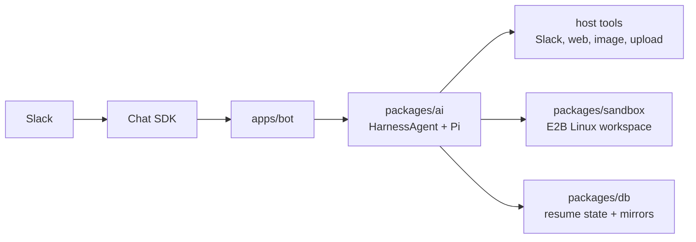

Gorkie is a Slack bot wrapped around a coding agent. Every Slack thread it joins gets its own agent and its own Linux workspace, so a conversation can write code, run commands, and remember what it did across days.

> [!NOTE]
> Core mental model: Pi runs on the bot machine. The sandbox is remote file and command execution.

That one sentence explains most of the architecture. The agent brain, model auth, tool orchestration, conversation history, and prompt loading all happen inside the bot process. The E2B sandbox gives that host process a remote Linux workspace where Pi can read files, write files, run commands, and keep per-thread state. Model keys and secrets never leave the host; the sandbox only ever sees the filesystem and shell side of the work.

The two pieces map cleanly onto the runtime:

- **Pi (the brain)** is an AI SDK 7 `HarnessAgent` running the `pi` coding agent. It owns the conversation, the tool loop, and history compaction. It lives in the bot's Node process.
- **The sandbox (the hands)** is a per-thread E2B sandbox. Pi's `bash`, `read`, `write`, and `edit` tools all execute there, but Pi itself never runs inside it.

Use these docs when you want to answer "where does this behavior live?" before changing code.

## Read This First

- [Architecture](./architecture): Main components, request flow, and ownership boundaries.
- [Slack Runtime](./slack-runtime): Chat SDK, routing, subscriptions, thread state, and DMs.
- [Agent Runtime](./agent-runtime): HarnessAgent, Pi, prompts, tools, attempts, and steering.
- [Sandbox And Sessions](./sandbox-sessions): E2B, host mirrors, session files, resume, and skills.
- [Streaming And Tools](./streaming-tools): Slack output, task rows, line chunking, and host tools.
- [Data Model](./data-model): Postgres tables and what each one owns.
- [Development](./development): Commands, template builds, checks, and reference repos.
- [Open Work](./open-work): Architectural debt and the next cleanup passes.

## Source Map

| Area | Files |
| --- | --- |
| Slack event routing | `apps/bot/src/bot.ts` |
| Chat SDK setup | `apps/bot/src/lib/chat.ts` |
| Turn orchestration | `apps/bot/src/lib/agent/index.ts` |
| Stop button and steering | `apps/bot/src/lib/agent/controls.ts`, `apps/bot/src/lib/agent/steering.ts` |
| Slack reply chunking | `apps/bot/src/lib/agent/line-reply.ts` |
| Stream/task rendering | `apps/bot/src/lib/ai/stream/**` |
| Host tools | `apps/bot/src/lib/ai/tools/**`, `apps/bot/src/lib/ai/toolset.ts` |
| Harness/Pi assembly | `packages/ai/src/agent.ts` |
| Prompts and model attempts | `packages/ai/src/prompts/**`, `packages/ai/src/providers/**` |
| Session resume | `packages/ai/src/sessions.ts`, `packages/ai/src/files/**` |
| E2B provider | `packages/sandbox/src/**` |
| Postgres schema/queries | `packages/db/src/**` |

## How It Fits Together

The system is split so that each concern has one clear home:

- **Slack** comes in through Chat SDK (`@chat-adapter/slack` in Socket Mode), which normalizes mentions, DMs, and subscribed replies into `Thread` and `Message` objects.
- **Pi/Harness** owns the agent loop, conversation history, and compaction. This is the durable memory of a thread, not Slack's transcript and not the database.
- **E2B** owns the per-thread Linux workspace where Pi's filesystem and shell tools run.
- **Postgres** stores Chat SDK state (subscriptions, locks, dedupe), sandbox runtime state, resume pointers, a mirror of Pi's session file, and per-user customizations.

If you are trying to answer "where does this behavior live?" before changing code, start with [Architecture](./architecture) for the ownership boundaries, then jump to the runtime page that matches the layer you care about.
