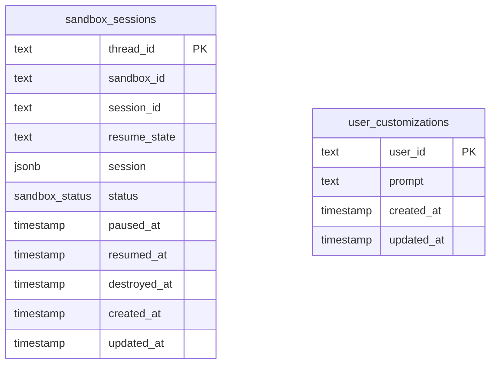

Gorkie stores app-owned runtime state in `packages/db`. Chat SDK also stores adapter state through `@chat-adapter/state-pg`; those tables are owned by the adapter package and are not defined in this repo.

## App-Owned Tables

## `sandbox_sessions`

Defined in `packages/db/src/schema/sandbox.ts`.

| Column | Type | Meaning |
| --- | --- | --- |
| `thread_id` | `text` primary key | Chat SDK thread id and Harness session id. |
| `sandbox_id` | `text not null` | E2B sandbox id. |
| `session_id` | `text not null` | Harness session id. |
| `resume_state` | `text` | JSON string returned by Harness detach. |
| `session` | `jsonb` | Pi transcript mirror: `{ file, data }`. |
| `status` | `sandbox_status not null default 'creating'` | Sandbox lifecycle state. |
| `paused_at` | `timestamp with time zone` | Last pause timestamp. |
| `resumed_at` | `timestamp with time zone` | Last resume timestamp. |
| `destroyed_at` | `timestamp with time zone` | Future destroy timestamp. |
| `created_at` | `timestamp with time zone not null default now()` | Row creation timestamp. |
| `updated_at` | `timestamp with time zone not null default now()` | Auto-updated row timestamp. |

Indexes:

| Index | Columns |
| --- | --- |
| `sandbox_sessions_status_idx` | `status` |
| `sandbox_sessions_paused_idx` | `paused_at` |
| `sandbox_sessions_updated_idx` | `updated_at` |

Enum:

| Enum | Values |
| --- | --- |
| `sandbox_status` | `creating`, `active`, `paused`, `destroyed` |

## `user_customizations`

Defined in `packages/db/src/schema/customizations.ts`.

| Column | Type | Meaning |
| --- | --- | --- |
| `user_id` | `text` primary key | Slack user id. |
| `prompt` | `text not null` | Saved App Home custom instructions. |
| `created_at` | `timestamp with time zone not null default now()` | Row creation timestamp. |
| `updated_at` | `timestamp with time zone not null default now()` | Auto-updated row timestamp. |
