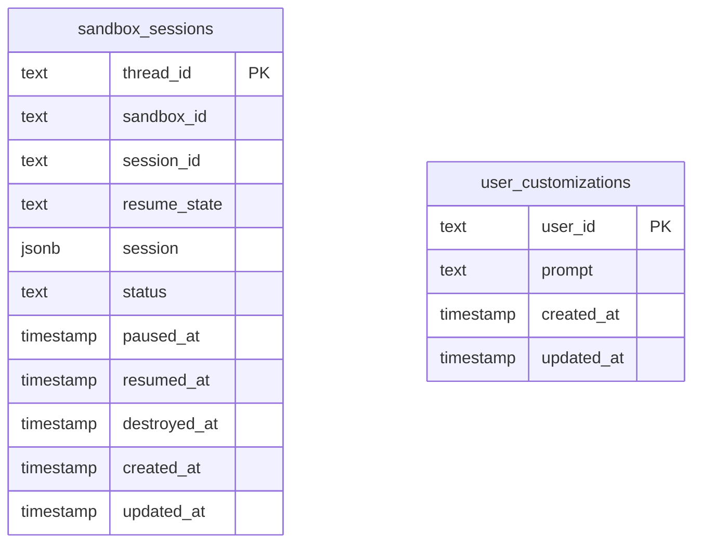

Gorkie stores runtime state in Postgres. It does not store a second full agent transcript.

## Main State

| State | Owner | Purpose |
| --- | --- | --- |
| Chat SDK state | `@chat-adapter/state-pg` | Subscriptions, locks, dedupe, adapter state. |
| `sandbox_sessions` | `packages/db` | E2B id, Harness session id, resume state, and Pi session mirror. |
| `user_customizations` | `packages/db` | App Home custom instructions per Slack user. |

## `sandbox_sessions`

`sandbox_sessions` connects a Slack thread to its sandbox and Harness/Pi session.

| Column | Meaning |
| --- | --- |
| `thread_id` | Chat SDK thread id and Harness session id. |
| `sandbox_id` | E2B sandbox id. |
| `session_id` | Harness session id. |
| `resume_state` | JSON string returned by Harness detach. |
| `session` | JSON mirror of Pi's session file. |
| `status` | Runtime lifecycle state. |
| `paused_at`, `resumed_at`, `destroyed_at` | Sandbox lifecycle timestamps. |
| `created_at`, `updated_at` | Row timestamps. |

## Transcript Ownership

Harness/Pi session history is the agent transcript. Postgres stores a resume pointer and a mirrored session file so a thread can recover after restarts or sandbox replacement.

Slack history is fetched when needed. It is not copied wholesale into a separate long-term memory table.
