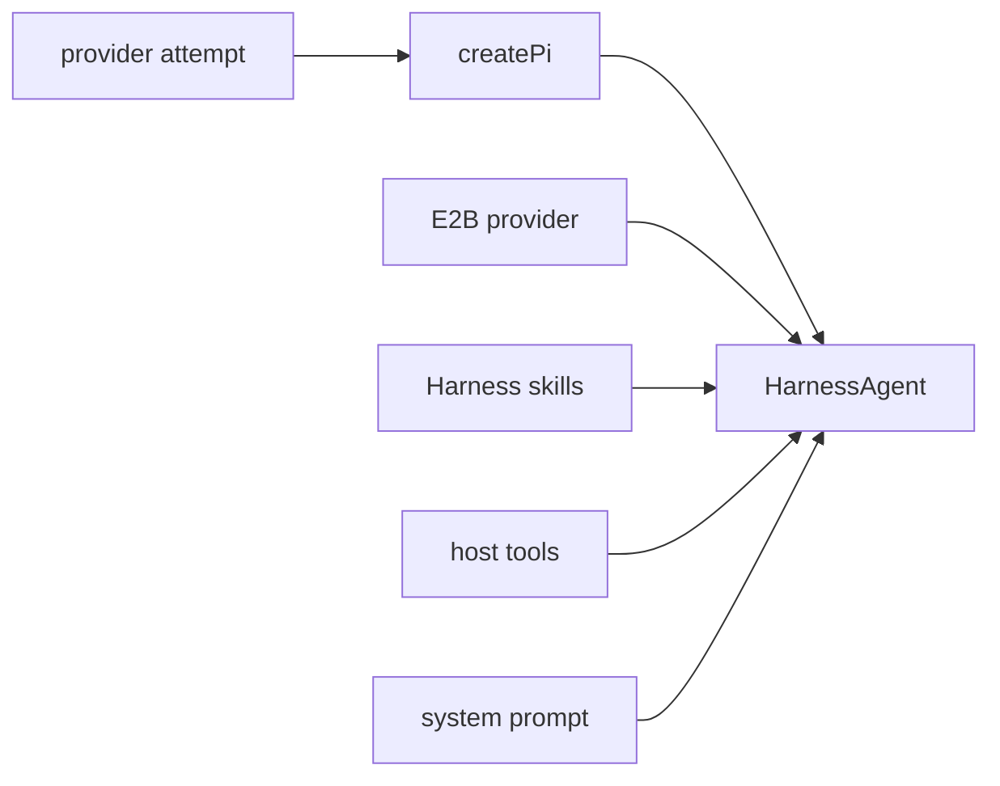

The agent runtime is built around AI SDK `HarnessAgent` with the Pi harness. The bot creates one agent for a turn, opens the thread's session, streams the response, detaches the session, and stores enough state to resume later.

## What Gets Built

`packages/ai/src/agent.ts` creates:

- a Pi harness from the selected provider attempt;
- a `HarnessAgent` with Pi, the sandbox provider, host tools, skills, and `permissionMode: 'allow-all'`;
- an `onSandboxSession` hook that writes the system prompt and syncs the Pi session file into the sandbox.

## Turn Runner

`apps/bot/src/lib/agent/index.ts` owns the app side of a turn:

1. set Slack assistant status to thinking;
2. load request hints and skills;
3. create the HarnessAgent;
4. open the persisted session;
5. seed Slack attachments into the sandbox;
6. stream text and task events;
7. flush Slack replies;
8. detach and persist the session;
9. pause the sandbox.

## Attempts

`packages/ai/src/providers/pi.ts` exports ordered provider attempts. Each attempt supplies the model id and custom environment passed into Pi.

The turn runner uses the first configured attempt. If an attempt fails before anything is streamed, it can fall back to the next attempt. Once text or task UI has reached Slack, the runner does not silently switch models, because that would create two partial answers for one user message.

Turn interruption, stop, and shutdown behavior is covered in [Turn Controls](./controls).
