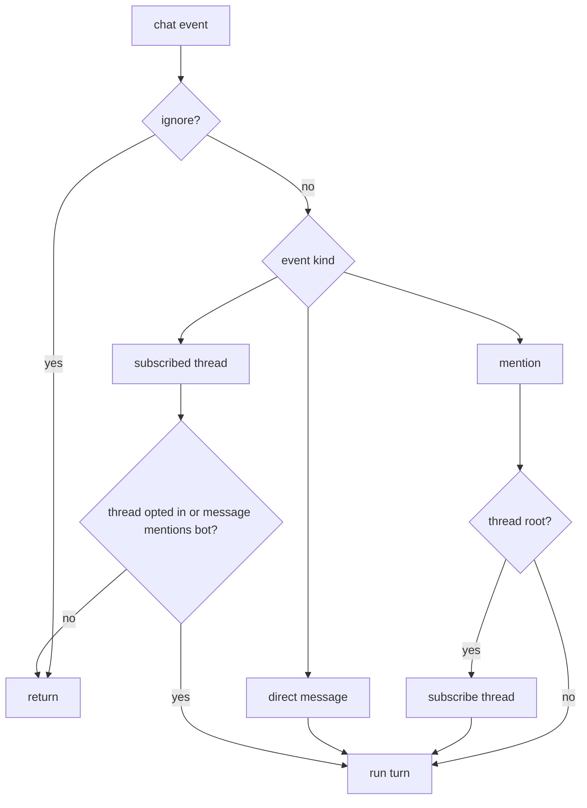

Slack events enter through Chat SDK's Slack adapter in Socket Mode. The adapter normalizes Slack events into `Thread` and `Message` objects; `apps/bot` decides whether to answer and starts the agent turn.

## Entry Points

| Handler | Purpose |
| --- | --- |
| `onNewMention` | A user mentioned Gorkie. |
| `onDirectMessage` | A user sent Gorkie a DM. |
| `onSubscribedMessage` | A message arrived in a thread Gorkie follows. |
| `onAction('stop_turn')` | A user clicked the active-turn stop button. |

## Ignore

Any message with a line that starts with `##` is ignored. Leading Slack mention tokens are stripped before this check, so `@gorkie ## ignore this` is ignored too.

Messages from bots and messages from Gorkie itself are ignored.

## Thread Opt-In

A root mention opts the thread into follow-up responses. Gorkie stores that state on the Chat SDK thread and subscribes to future replies.

A mention inside an existing thread is treated as a one-off request unless the thread was already opted in.

## DMs

DMs are direct intent. Gorkie subscribes to the DM thread and answers.

> **Private context:** Reader tools must stay scoped. A user should not be able to use Gorkie to read another user's private DM or private-channel context.

## Slack APIs

Chat SDK handles the normal platform shape. Gorkie uses raw Slack APIs for Slack-only behavior:

- native assistant thinking status;
- App Home customizations;
- stop button blocks;
- file uploads;
- scheduled reminder messages;
- assistant search.
