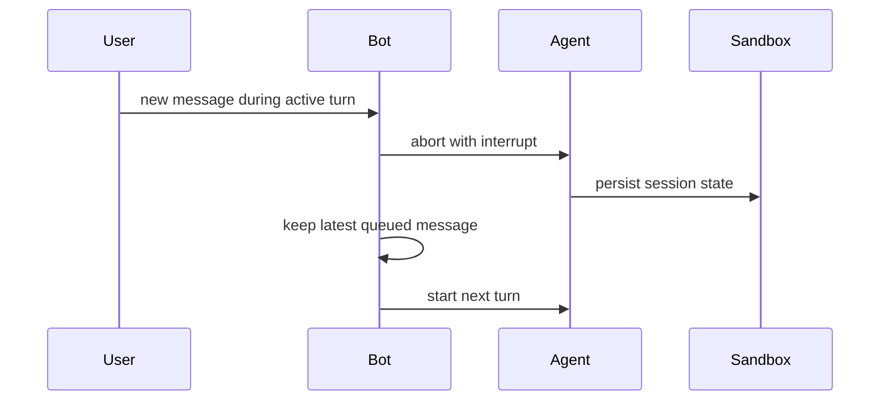

Gorkie can end a running turn for three reasons: a newer user message, a stop button click, or process shutdown.

## Interruption

If a user sends another message while a turn is active, Gorkie interrupts the current turn and restarts from the newest queued message.

The interrupted turn still parks its session state. The sandbox stays warm because the next turn starts immediately.

Only the latest queued follow-up is replayed. Earlier messages in the same burst are superseded by the newest one.

## Stop

The stop button is a Slack control message posted while a response is active. It aborts the turn with reason `stop`, deletes the control message, persists the session, and pauses the sandbox.

The button is separate from the final task list because users need it during the active response, not after streaming finishes.

## Shutdown

Shutdown aborts every active turn with reason `shutdown`. Those turns persist their session state and do not replay queued messages.

## Session Parking

All abort paths try to persist the Harness/Pi session. The difference is sandbox lifecycle:

| Reason | Replay queued message? | Pause sandbox? |
| --- | --- | --- |
| `interrupt` | Yes, latest only | No |
| `stop` | No | Yes |
| `shutdown` | No | Yes |
