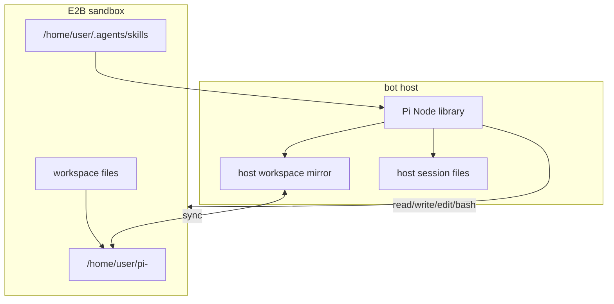

Each Slack conversation gets a persistent E2B Linux workspace. Pi runs on the bot host and uses the sandbox for file and shell operations.

## Runtime Layout



## Sandbox Provider

`packages/sandbox/src/provider.ts` implements the Harness sandbox provider. It can create a sandbox, resume one by id, detect a stale or missing sandbox, create a replacement, pause it, and update the `sandbox_sessions` row.

`packages/sandbox/src/session.ts` adapts E2B to the sandbox operations the agent needs: read files, write files, run commands, spawn processes, and restrict paths.

## Session Persistence

There are two related pieces of state:

| State | Purpose |
| --- | --- |
| `resumeState` | Harness/Pi pointer used to reopen a session. |
| Pi session file | Actual transcript and tool history, mirrored into Postgres for recovery. |

<Steps>
  <Step>
    Load the stored resume state and session-file mirror.
  </Step>

  <Step>
    Create or resume the E2B sandbox.
  </Step>

  <Step>
    Re-seed the mirrored Pi session file when the sandbox needs it.
  </Step>

  <Step>
    Open the Harness session.
  </Step>

  <Step>
    Detach, mirror the updated session file, store resume state, and pause the sandbox.
  </Step>
</Steps>

## Skills

Skill instructions live on the host under `packages/sandbox/skills/`. They are passed into Harness as skills, and the Pi adapter materializes them inside the sandbox under `$HOME/.agents/skills`.

The E2B template installs the runtime packages those skills need, such as `agent-browser` and `agentmail`. The template does not need to be the source of truth for `SKILL.md` files.

## Template Build

Build the E2B template when sandbox runtime dependencies change:

```sh
bun run build:template
```

The build script loads `apps/bot/.env` through `dotenv` so `E2B_API_KEY` stays outside tracked files.
