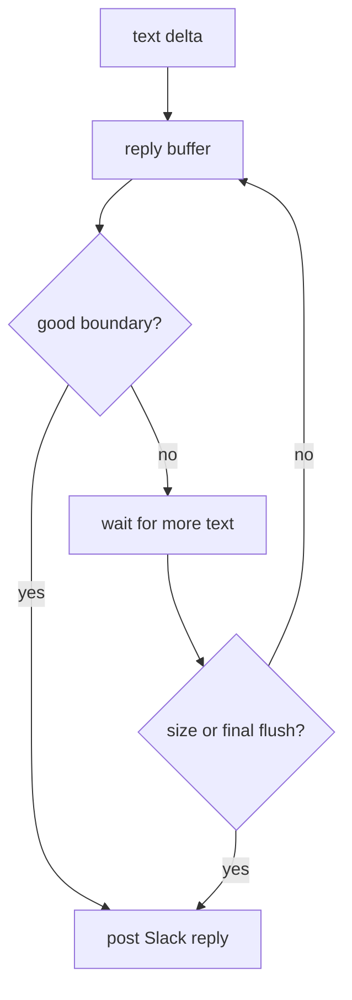

Gorkie renders a turn through two Slack output paths:

- assistant text is posted as normal Slack replies through `createLineReply`;
- reasoning and tool activity are rendered as task rows through Chat SDK `StreamingPlan`.

<Callout type="warn" title="Slack message limits">
  Long native Slack stream buffers can fail with `msg_too_long`. Gorkie keeps assistant text outside the native stream buffer so long answers can be split into multiple Slack messages.
</Callout>

## Text Replies

`apps/bot/src/lib/agent/line-reply.ts` buffers text deltas and posts chunks at natural boundaries. It prefers paragraph breaks, then sentence or line boundaries, and falls back to a hard size split before Slack's message limit.

The splitting logic also avoids splitting inside open fenced code blocks.

## Task Rows

`apps/bot/src/lib/ai/stream/index.ts` consumes AI SDK stream parts and turns tool activity into task updates.

| Stream part | Slack behavior |
| --- | --- |
| `reasoning-start` / `reasoning-delta` / `reasoning-end` | Show and complete the Thinking row. |
| `tool-call` | Add an in-progress task row. |
| `tool-result` | Complete the task row. |
| `tool-error` | Show the error in the task output. |

Task rows are capped. Once the visible list is full, Gorkie updates a single overflow row instead of posting unbounded task UI.

## Stop Control

The stop button is a separate Slack control message. It appears when the first text or task event reaches Slack and is deleted when the turn ends.

The button is not part of the final task list because users need it during the active response, not after the response finishes.
