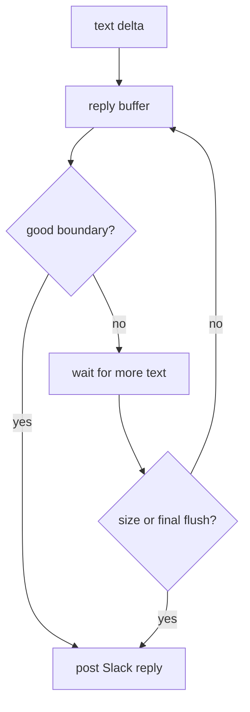

Gorkie renders a turn through two Slack output paths:

- assistant text is posted as normal Slack replies through `createReply`;
- reasoning and tool activity are rendered as task rows through Chat SDK `StreamingPlan`.

> **Slack message limits:** Long native Slack stream buffers can fail with `msg_too_long`. Gorkie keeps assistant text outside the native stream buffer so long answers can be split into multiple Slack messages.

## Text Replies

`apps/bot/src/lib/agent/reply.ts` buffers text deltas and posts chunks at natural boundaries. It prefers paragraph breaks, then sentence or line boundaries, and falls back to a hard size split before Slack's message limit.

The splitting logic also avoids splitting inside open fenced code blocks.

## Task Rows

`apps/bot/src/lib/ai/stream/index.ts` consumes AI SDK stream parts and turns reasoning and tool activity into Chat SDK task updates. These rows render above the assistant reply.

| Stream part | Slack behavior |
| --- | --- |
| `reasoning-start` / `reasoning-delta` / `reasoning-end` | Show and complete the Thinking row. |
| `tool-call` | Add an in-progress task row. |
| `tool-result` | Complete the task row. |
| `tool-error` | Show the error in the task output. |

## Task Lifecycle

Each tool call has a stable task id from the AI SDK `toolCallId`.

1. On `tool-call`, Gorkie stores the tool input, logs `[tool] called`, renders a request title/details, and yields an `in_progress` task row.
2. On `tool-result`, Gorkie pairs the result with the stored input, logs `[tool] completed`, renders a response title/output, and marks the same task row `complete`.
3. On `tool-error`, Gorkie pairs the error with the stored input, logs `[tool] failed`, renders an error output, and marks the same task row `error`.

Example Slack task flow:

| State | Title | Details/output |
| --- | --- | --- |
| In progress | `Searching Slack` | `freevm from:twa` |
| Complete | `Searched Slack` | `Found 3 results.` |

Another example:

| State | Title | Details/output |
| --- | --- | --- |
| In progress | `Reading conversation` | `slack:C123456:1781599802.270109` |
| Complete | `Read conversation` | `Read 40 messages.` |

## Renderer Contract

Task text comes from per-tool renderers in `apps/bot/src/lib/ai/stream/tasks`.

Each renderer can define:

- `title`: default title for the tool;
- `request`: title/details while the tool is running;
- `response`: title/output when the tool returns normally;
- `error`: output for thrown tool errors.

Fallback rendering exists, but the intended shape is one clear renderer per exposed tool. A user should see "Uploaded file" or "Read conversation", not raw serialized input/output.

## Error Results

Some tools return a normal result object with an `error` field instead of throwing. That means the tool call completed from the stream's point of view, but the tool's operation failed.

Gorkie renders those as completed task rows with bold error output:

| State | Title | Output |
| --- | --- | --- |
| Complete | `Read channel` | `**Error**: An API error occurred: missing_scope` |

If the tool itself throws, Gorkie marks the task row failed instead. That is reserved for execution failures where the tool did not return a normal result.

## Overflow

Task rows are capped at 45 visible task ids. Once the visible list is full, Gorkie stops adding one row per tool and updates a single overflow row instead:

| State | Title | Output |
| --- | --- | --- |
| In progress | `Tool activity: 12` |  |
| Complete | `Tool activity: 12` | `Ran 12 additional tools.` |

This keeps Slack task UI bounded during tool-heavy turns and avoids another path to oversized Slack messages.

Turn controls are covered in [Turn Controls](./controls).
