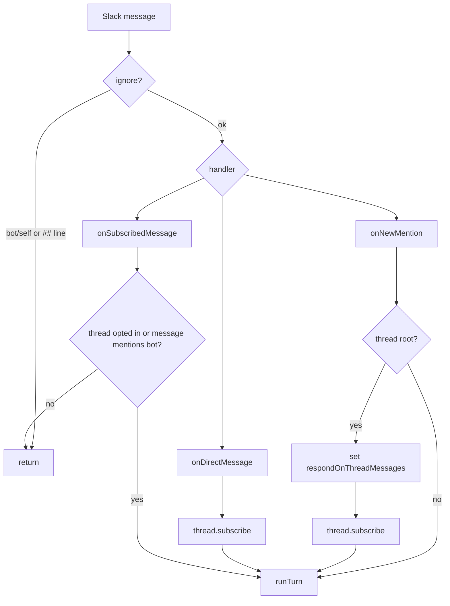

Every Slack event enters Gorkie through Chat SDK in Socket Mode. This page covers how those events are routed into agent turns; what happens inside a turn lives in [Agent Runtime](./agent-runtime).

`apps/bot/src/lib/chat.ts` creates:

- a Slack adapter (`createSlackAdapter`) in `socket` mode, authenticated with `SLACK_APP_TOKEN` and `SLACK_BOT_TOKEN`;
- a Postgres Chat SDK state adapter (`createPostgresState`) for subscriptions, locks, and dedupe;
- a `Chat` instance with `userName: 'gorkie'` and `concurrency: 'concurrent'`;
- a logger bridge that prefixes Chat SDK logs with `[chat]`.

## Routing

`apps/bot/src/bot.ts` wires the main handlers:

| Handler | Meaning in Gorkie |
| --- | --- |
| `onNewMention` | A user mentioned Gorkie. If the mention is a thread root, Gorkie also opts the thread in and subscribes to it. |
| `onDirectMessage` | A user DM'd Gorkie. The DM thread is subscribed and a turn runs. |
| `onSubscribedMessage` | A message arrived in a thread Gorkie is subscribed to. |
| `onAction('gorkie_stop_turn')` | A user clicked the stop button on an active turn. |



## Ignore Rule

Gorkie skips any message where **any line** starts with the ignore marker `##`. This lets people leave side notes in a thread Gorkie is watching without triggering a response.

Slack leaves mention tokens in the raw text, so the router strips leading `<@USER>` pings from the start of each line before checking for `##`. These messages are ignored:

```text
## do not answer
@gorkie ## do not answer
first line is fine
## but this later line asks to ignore
```

This message is **not** ignored, because no line begins with `##` after stripping the ping:

```text
@gorkie normal request
```

Messages from bots or from Gorkie itself are always ignored.

## Thread State

Gorkie only answers ordinary follow-up messages in threads it has opted into. The opt-in is a single Chat SDK thread-state flag:

```ts
{ respondOnThreadMessages: true }
```

When a mention is the root of a thread, `onNewMention` sets this flag and subscribes the thread, so subsequent replies flow through `onSubscribedMessage` and are answered automatically. A mention deeper inside an existing thread runs a one-off turn without opting the whole thread in. In a subscribed thread, `onSubscribedMessage` answers a follow-up only if `respondOnThreadMessages` is set **or** the message explicitly mentions Gorkie. This keeps Gorkie from latching onto a busy thread forever after a single incidental mention.

## DMs

DMs are direct intent. The bot subscribes to the DM thread and runs a turn.

> [!WARNING]
> DM read access is powerful: Gorkie can read DMs the bot token can access. Reader tools must stay scoped so one user cannot use the agent to sniff another user's private DM context.

## Slack Escape Hatches

Chat SDK handles the normal platform shape. Gorkie still reaches for Slack APIs directly for Slack-specific behavior:

- assistant thinking status;
- App Home;
- stop button block;
- file upload;
- scheduled reminder messages;
- assistant search context.

Those escape hatches stay in `apps/bot`.
