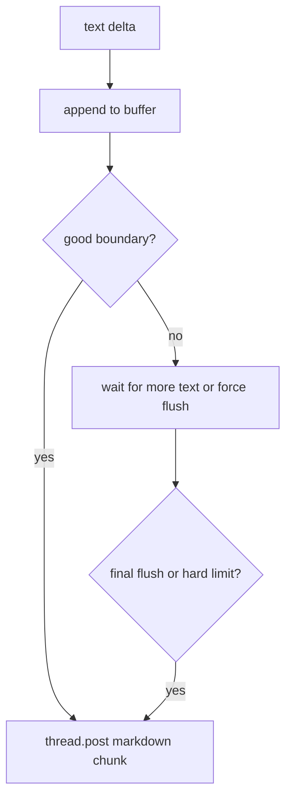

Gorkie uses two Slack output paths during a turn:

1. `StreamingPlan` for task rows and reasoning status.
2. `createLineReply` for assistant text split into normal Slack messages.

This avoids Slack `msg_too_long` failures from one huge native stream message.

> [!WARNING]
> Why text is outside StreamingPlan: Chat SDK's Slack stream ultimately writes to Slack's native stream buffer. In live tests, long assistant output and large fetched-message text could still fail with `msg_too_long`. Gorkie keeps tasks in `StreamingPlan`, but assistant text goes through `createLineReply` so it can be posted as several normal Slack messages at paragraph or sentence boundaries.

## Stream Events

`apps/bot/src/lib/ai/stream/index.ts` consumes AI SDK full-stream parts:

| Part | Behavior |
| --- | --- |
| `text-delta` | Sent to `createLineReply`. |
| `reasoning-start` | Adds a Thinking task row. |
| `reasoning-delta` | Buffers reasoning text. |
| `reasoning-end` | Completes the Thinking task row. |
| `tool-call` | Logs and renders an in-progress task row. |
| `tool-result` | Logs and completes the task row. |
| `tool-error` | Logs and marks the task row as error. |

Task rows are capped. After the visible cap, Gorkie updates one overflow row like `Tool activity: N`, then completes it with `Ran N additional tools.`

## Assistant Text Chunking

`apps/bot/src/lib/agent/line-reply.ts` keeps a text buffer and posts chunks at natural boundaries:

- paragraph breaks first;
- sentence boundaries next;
- line breaks if needed;
- hard split before Slack's message-size danger zone.

It avoids splitting inside an open fenced code block.



## Tool Task Rendering

Task rendering is per tool, not a generic JSON dump.

`apps/bot/src/lib/ai/stream/tasks/index.ts` maps `toolName` to a renderer entry:

```ts
{
  request?: renderer;
  response?: renderer;
  title: string;
}
```

Examples:

- `generateImage`: "Generating image" then upload count.
- `searchSlack`: query then result count.
- `sendDirectMessage`: recipient then sent status.
- `fetchMessages`: target then message count.
- `bash`: command preview.

Default rendering exists as a fallback, but every tool should get explicit success and error renderers so its task row reads clearly instead of dumping raw JSON.

## Host Tools

Host tools live in `apps/bot/src/lib/ai/tools`.

| Tool | Purpose |
| --- | --- |
| `searchSlack` | Slack assistant search using Slack's action token. |
| `searchWeb` | Current web search through Exa. |
| `summarizeThread` | Fetches a thread and summarizes it with a language model. |
| `generateImage` | Generates images and uploads them to Slack. |
| `uploadFile` | Uploads a sandbox workspace file to the current Slack thread. |
| `mermaid` | Renders Mermaid through mermaid.ink and uploads a PNG. |
| `scheduleReminder` | Schedules a one-time Slack reminder DM. |

Chat SDK tools come from `createChatTools({ preset: 'messenger' })`. That gives Gorkie message, thread, channel, user, and reaction tools. Write-tool approval is still a product decision.

## Tool Safety

Important boundaries:

- The streamed assistant text is the reply. Pi should not call `postMessage` to answer the current user.
- `uploadFile` can only upload from the active sandbox workspace.
- Slack search may require a Slack assistant action token.
- DM and private-channel read tools need stricter scope gates before broader Slack context work.
